## Day 1: Define system idea
Okay, to clarify my idea:
I want to make a set of ten 1-meter-long LED tubes to offer lighting similar to the "Versatube" style—products that used to be sold but apparently disappeared from the market.
The goal is to create a set of 10 tubes that can be daisy-chained and controlled via a microcontroller.
Initial Bill of Materials (BOM) draft:
-> 10 PCBs (one per tube, with a microcontroller on each)
-> 10m of WS2812B LEDs
-> Aluminum profiles with milky diffusers
...bringing the estimated total to over $180.
Of course, this BOM will likely change as I experiment further.

This is my idea: 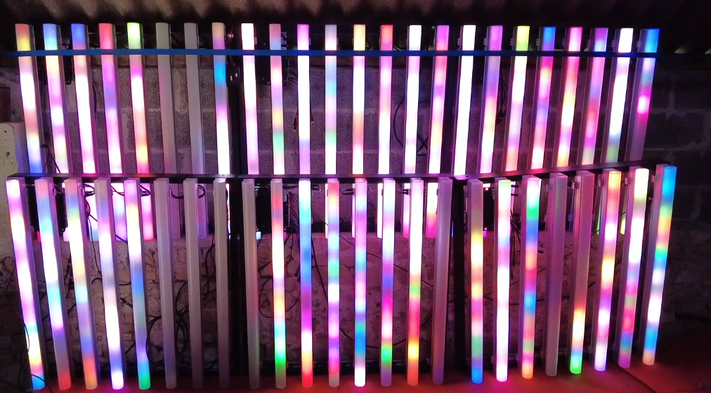
You can see a video in french with presentation of VersaTube (https://www.youtube.com/watch?v=FrGhFqn37Wc)

First challenge for tomorrow:
Make the PCB.

**Total time spent: 2.5 hours**

## Day 2 & 3: Today is day of my first real PCB created
I start to understand KiCad and PCB design with youtube videos (in french ^^):
https://www.youtube.com/watch?v=dAck3bxzehA&pp=ygUFa2ljYWQ%3D
https://www.youtube.com/watch?v=d9_-lQq8ShE&pp=ygUFa2ljYWQ%3D
https://www.youtube.com/watch?v=O7QsrLDFyKQ

After see all of this videos I start to design my circuit on KiCad scheme project:

I remake lot of time circuit because I would like to be perfect circuit !

24V IN / OUT:
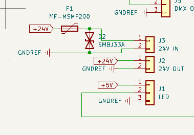

DMX IN / OUT:
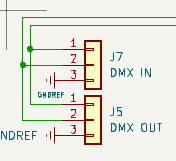

DMX Transeiver:
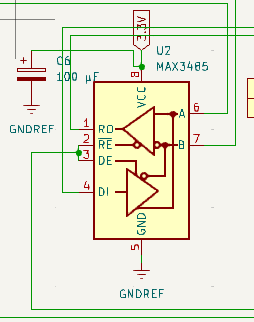

24V > 5V:
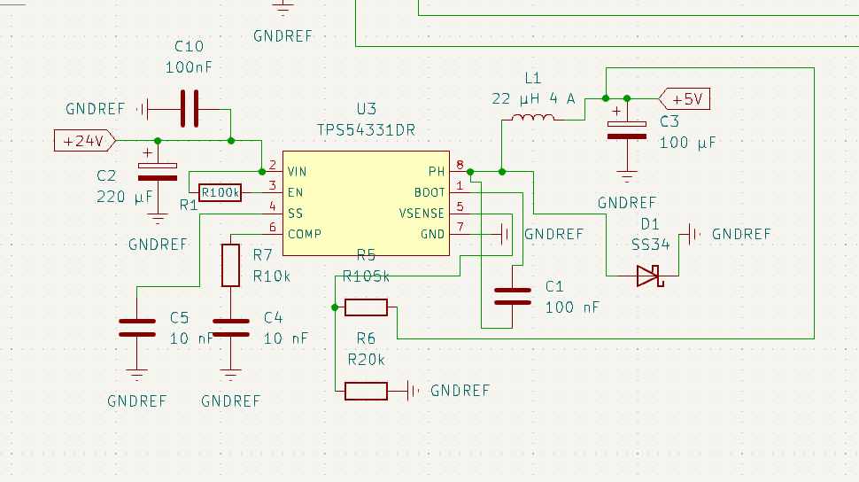

5V > 3V:
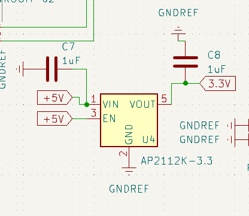

USB:
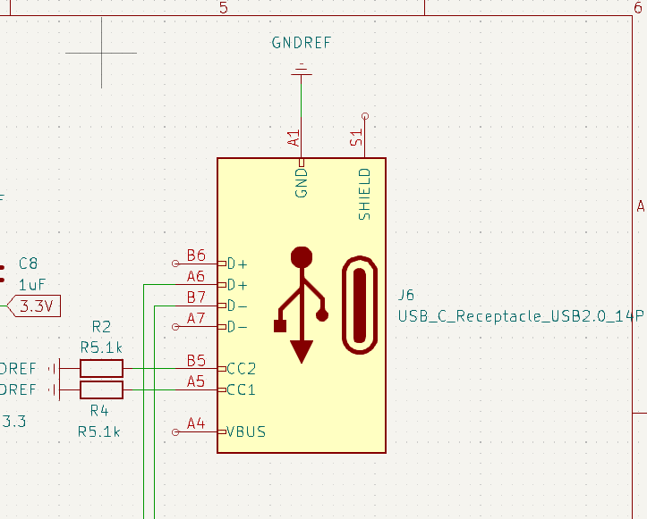

ESP with button for RESET:
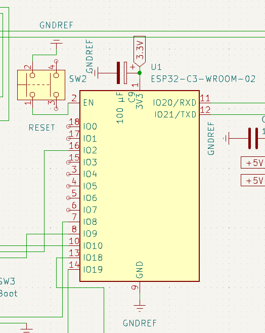

This is scheme completly finished:
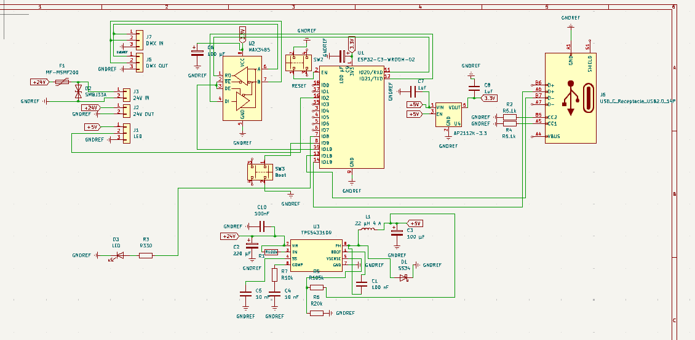

Next part: Design PCB and routing it
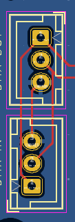
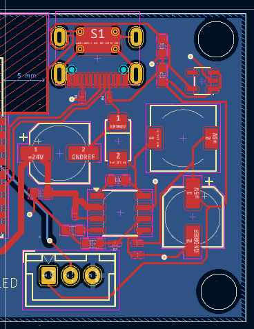
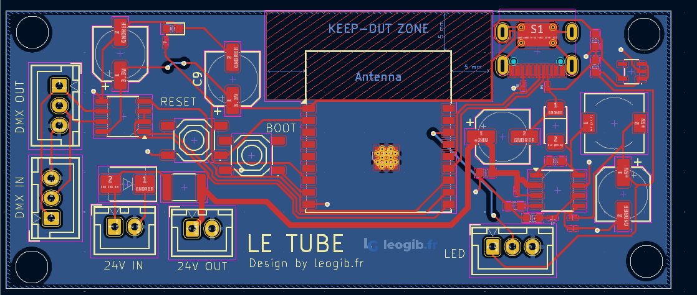

I remake it totaly 3 times:
- because my scheme was not good at start and I change lot of thing so I have prefered to restart
- because I forgotten using 2 plate of Cuivre :( so I route all GND together ... I say it's impossible before rewatching video and making a fullfilled GND at bottom
- final version

Two day passed on this PCB

**Total time spent: 5.5 hours**

## Day 4: Export project, push it to JLCPCB
I export my project with JLCPCB plugin, I make all BOM of materials:

Designator,Footprint,Quantity,Value,LCSC Part #
C1,C_0603,1,100 nF,C14663
C10,C_0603,1,100nF,C14663
C2,CP_Elec_6.3x7.7,1,220 µF,C2887273
C3, C6, C9,CP_Elec_6.3x5.8,3,100 µF,C128464
C4, C5,C_0603,2,10 nF,C57112
C7, C8,C_0603,2,1uF,C90540
D1,D_DO-214AC(SMA),1,SS34,C8678
D2,D_SMB,1,SMBJ33A,C224019
D3,D_0603,1,LED,C2286
F1,1812,1,MF-MSMF200,C210837
J1,JST_XH_B3B-XH-A_1x03_P2.50mm_Vertical,1,LED,C144394
J2,JST_XH_B2B-XH-A_1x02_P2.50mm_Vertical,1,24V OUT,C158012
J3,JST_XH_B2B-XH-A_1x02_P2.50mm_Vertical,1,24V IN,C158012
J5,JST_XH_B3B-XH-A_1x03_P2.50mm_Vertical,1,DMX OUT,C144394
J6,TYPE-C-SMD_HX-TYPE-C-16PIN,1,USB_C_Receptacle_USB2.0_14P,C165948
J7,JST_XH_B3B-XH-A_1x03_P2.50mm_Vertical,1,DMX IN,C144394
L1,L_7.3x7.3_H4.5,1,22 µH 4 A,C2962887
R1,0201,1,R100k,C25803
R2, R4,0201,2,R5.1k,C23186
R3,0201,1,R330,C23138
R5,0201,1,R105k,C2933128
R6,0201,1,R20k,C2082894
R7,0201,1,R10k,C25804
SW2,SW-SMD_4P-L5.1-W5.1-P3.70-LS6.5-TL-2,1,RESET,C49023761
SW3,SW-SMD_4P-L5.1-W5.1-P3.70-LS6.5-TL-2,1,Boot,C49023761
U1,ESP32-C3-WROOM-02,1,ESP32-C3-WROOM-02,C2934560
U2,SOIC-8_3.9x4.9mm_P1.27mm,1,MAX3485,C9943
U3,SOIC-8_3.9x4.9mm_P1.27mm,1,TPS54331DR,C9865
U4,SOT-23-5_L3.0-W1.7-P0.95-LS2.8-BL,1,AP2112K-3.3,C51118

I search all reference at hand (LSCS References, it's horrible to find exact print on PCB and LSCS), after make this I push it to JLCPCB and make simulations with all parameters for see (at this moment I think 1 PCB = around 5$ max (Me, you future idiot, thinking that))

And ...
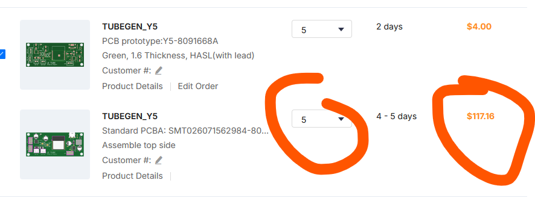

Whatttttttt ????? 120$ WITHOUT fees for assembling this (for 5 !)
At that point, I questioned the entire project because it didn't fit the budget at all.
I also forgot the power supply in the BOM.
After a lot of fruitless thinking—nothing came of it—I’m stopping for today.

**Total time spent: 3 hours**

## Day 5: Project turnaround, new vision
Today I think about this problem and, I found a solution !!

I don't see how I didn't think of that sooner.

The idea:
-> have a big bloc of alimentation (12V, xA, yW) (x and y be calculated soon ...) and a Bloc of DMX sending (like ESP32)
-> each tube have: 1 line of WS2812 led strip of 1 meter 
-> so with: no need a microcontroler in all tube, no need PCB

This idea seems like a good one to me for the moment.
So I just need:
- aluminum profile
- Power Supply
- WS2812B
- MicroControler (like ESP)

Now I will calculate Power Supply necessarie:
0.3W / led at full wight (max consumption)
so for 1 meter at 144 LED / m --> 144*0.3=43W per meter
for 10 meter --> 10 * 43W = 430W for installation total

We always take 20% for safety reason sor 430 x 1.2 = 516W

Alimentation need to give: 
I = P / U => 516 / 12 = 43 A --> It's big :)

!! ATTENTION !!
For cable bettween alim and 12 Way Terminal M6 Stud Bus can support 600W 50A so obligatorie choice a 6mm² section cable (I will try to find it at home) and 1.5mm² of section cable for the other

I found this one: https://fr.aliexpress.com/item/1005002843829663.html (35.99€)
So for partial BOM:
-> https://fr.aliexpress.com/item/1005002843829663.html (35.99€)
-> https://fr.aliexpress.com/item/1005012578071997.html (2*6.5€)
-> https://fr.aliexpress.com/item/1005002322065611.html (20*0.5m = 51€)
-> https://fr.aliexpress.com/item/1005007989431712.html (5*2m = 12.79€)
-> wires (find at home)
-> microcontroler (find at home (ESP-WROOM-32))

==> 182.8€ arround $199,55 😱

I search during 2 hours to find best price for each part
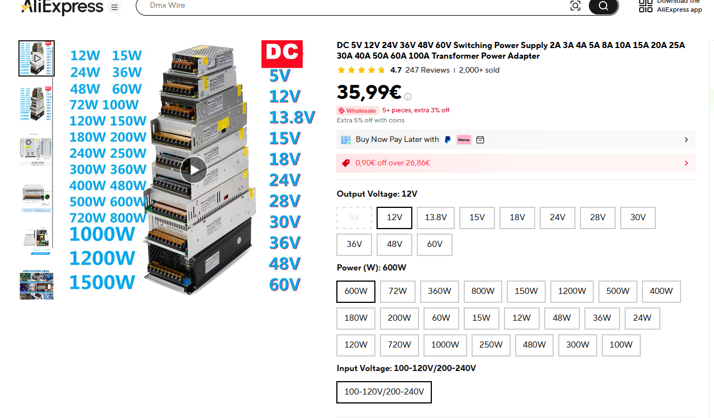

**Total time spent: 3 hours**

## Day 6: Software time !
So my project need to be connected with QLC+ (DMX manager) via ArtNet or cable
For this project, and with seen short budget it's in ArtNet I will connect this project

I start to find how to make my software or to find a software for ESP to manage this.

So I keeping this in mind for further research:
- WLED (famous !)
- FastLED
- Tasmota
- ESPixelStick (ArtNet big support)
- Pixelblaze

My first criteria:
ArtNet Support -->
WLED = OK
FastLed = So so ... (libs)
Tasmota = NO
ESPixelStick = Ok
PixelBlaze = NO

so WLED or (FastLed) or ESPIxelStick
I search youtube video for see differences in video and make decision 
https://youtu.be/Z2sAVM3pwFM?si=V13lelKXFeBYc6Ve
https://youtu.be/exAWzMfmwQ8?si=ewpfCq32tW1L6fjD
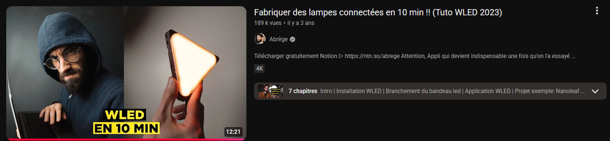

https://youtu.be/Da7x91w44T0?si=RJCx_LoPbBkOXw7Q

I choiced WLED (more famous but ArtNet less supported and less real-time)

How to flash WLED on ESP ?
Just follow guide:
https://install.wled.me/

I try with on of my card ESP-WROOM-32
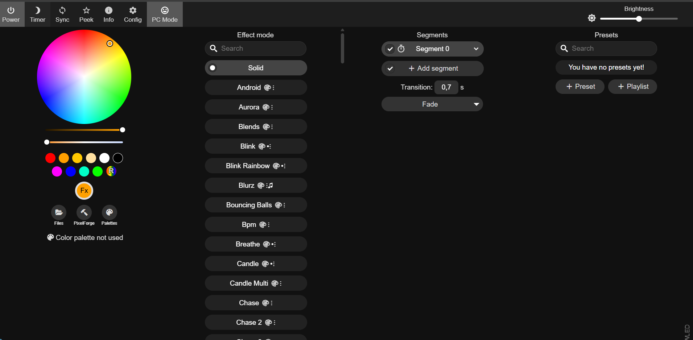
I have problem with my driver on Windows I need to uninstall Arduino IDE / reinstall Arduino IDE because driver does not detect my cart on COM port so I cannot flash it from chrome

Now how to connect it with QLW with DMX
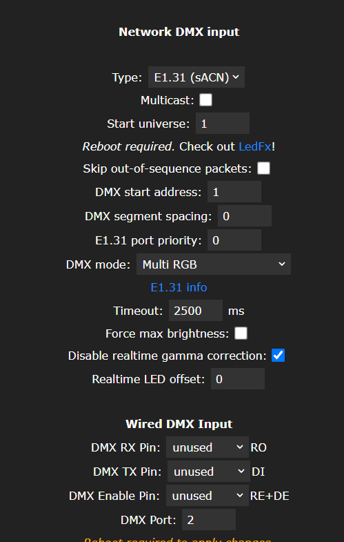

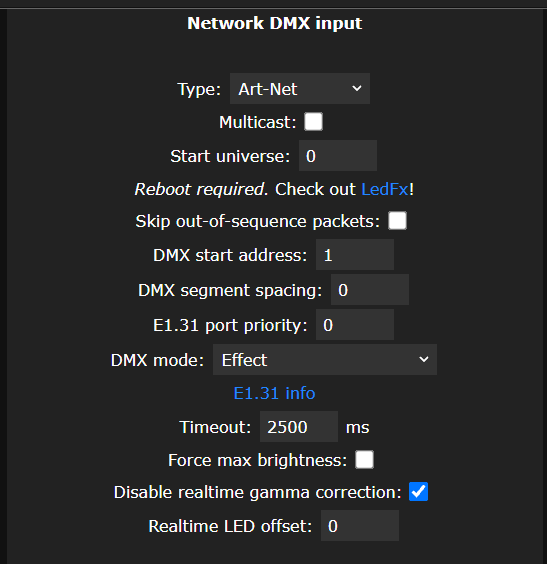
this is DMX parameters to initialize

ESP was HOT while running WLED !!! PAY ATTENTION FOR FUTURE CONCEPTION

**Total time spent: 3.5 hours**

## Day 7: Scheme day
I made little electrical scheme:

this represent cablage of tube bettween us and data system

This is sorted data from technical doc:

For connfirm choice of my aluminum profile is 7mm of light space (also difference between light on strip so normally no pixel effect visible)

**Total time spent: 1 hours**

## Day 8: Fusion 360 !!!
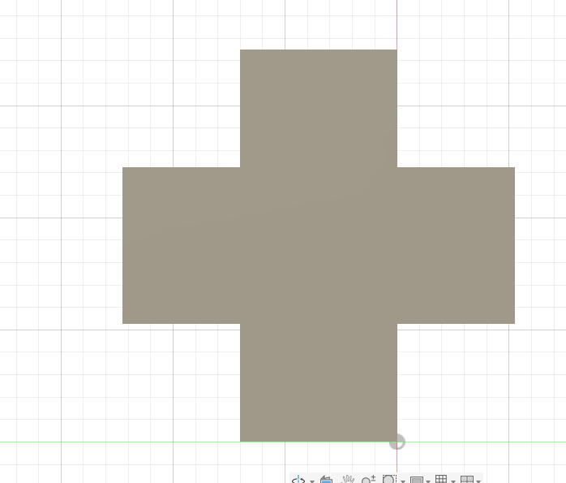
I made only this because I want to have this value I havent:
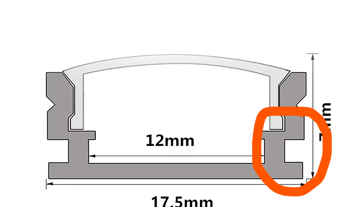

Just when I got this I measure this and add 2 cube for each sides to make feet on my tubes
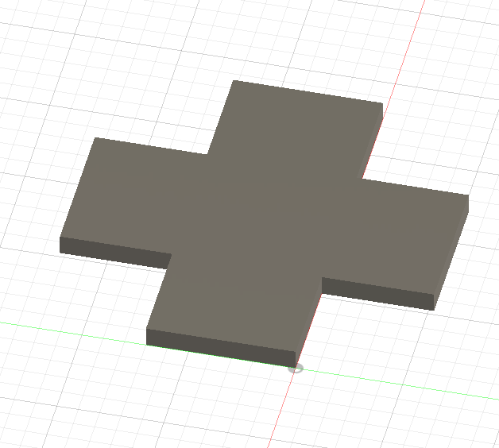

I also remake test in Wled with DMX and a little band of led I have at home (I forgot to take a picture; I think I was too focused 😅)
So for recap this test: It's work but I have big latency between QLC+ and my WLED reaction
I try to change mode of WLED (not RGB mode but effect ? preset ? and this not works)
I also try with another ESP to generate wifi AP for reduce distance between AP and ESP but nothing I made works, I reinstalling and reconfigure WLED because I follow Reddit post but nothing (lost 2 hours for nothing)

**Total time spent: 2.5 hours**

## Day 9: Focus on this bug of latency
This project is intended for use in shows or similar settings, which require real-time performance; however, I am currently observing a latency of several seconds—up to four seconds—before the changes take effect.

I want to isolate the problem, so I took the DIY ArtNet-to-DMX module I built at home, and I'm going to test whether the same thing happens with a moving head This will allow me to determine whether the issue stems from the QLC+ software.

After a good 30 minutes of testing with various QLC+ settings, I have no latency on my moving heads (bearing in mind that this module generates its own Wi-Fi and we are simply broadcasting via 4.1.0.3).

So it must be coming from the board or WLED.

So my next test is to swap the card and see if the same thing happens.

After reinstalling WLED, completely reconfiguring the DMX settings from scratch, and testing it, it seems a bit better—I've gained about 2 seconds of latency on each change.

I put my first ESP back in, but I don't understand—it's the same WLED configuration.

Well, sometimes it's best not to overthink it; I'll just grab the second ESP and keep going with that, but I'm still getting a 1-2 second lag—I absolutely need to find out where it's coming from.

Let's go!
I figured it out: when I moved closer to my router, I noticed the latency disappeared. I tried again with the other ESP, but the 2-second latency came back, so I think there must be a defect or something with that one!
Une image de la config qlc: 
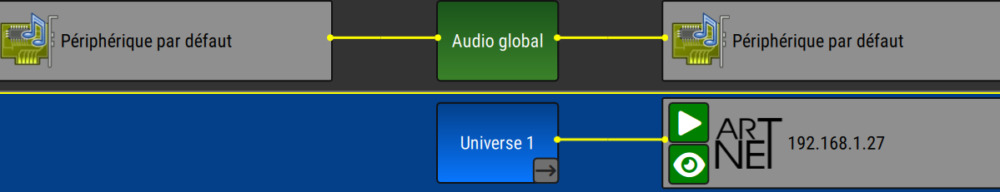

I think I went through every single menu in QLC+ and WLED to see where it was coming from, lol.

**Total time spent: 3.5 hours**

## Day 10: Last prepare, preparation of final BOM, test of software, recalculate all ... 
Today I prepare all for submit

**Recalculate necessary PowerSuply:**
With reviewing my choiced LED I found I have take 5V LED ??????
Noooooo....
I'm such an idiot.
Lets go find LED strip to 12.69E/2m :( 2815 not 2812 !
I found this:
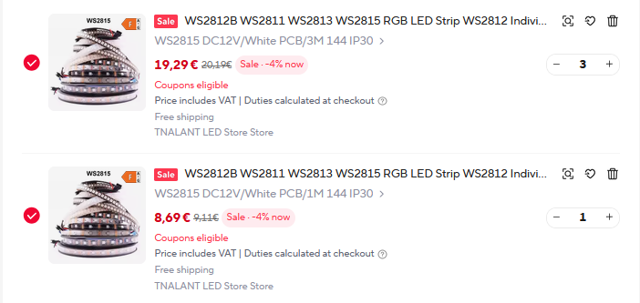
but ... 
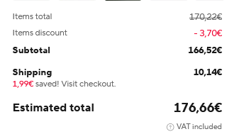
what ?
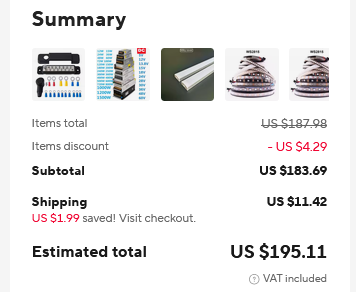
I pass it in dollars and it's good lol

I change BOM and lets go, It's very difficult to find cheap strip in WS2815

On the doc I found this:
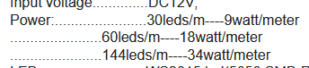
Considerating 34W / m so for total of
34*10 = 340W
I = P / U => 340 / 12 = 30 A

So my alimentation are a good choice for 20% safety and more

**Software test:**
All it's works with WLED and QLC with no latency bettween systems

**BOM:**

-1-28pcs/Lot perfil aluminio led lights 0.5 meters Office light belt aluminum profile for diode 5730 2835 LED hard light strip --> 50.99€
-WS2812B WS2812 RGB Led Strip Light Addressable Smart Individually Pixel LED Strip Tape Rope 30/60/74/96/144Pixel/Leds/M DC5V 2m * 5 --> 63.45€
-12 Point Battery Bus Bar Power Distribution Block Screw Terminal Stud M6 Electric Busbar 48V DC Black Red Automotive Car Boat *2 --> 13€
-DC 5V 12V 24V 36V 48V 60V Switching Power Supply 2A 3A 4A 5A 8A 10A 15A 20A 25A 30A 40A 50A 60A 100A Transformer Power Adapter 12V 600W --> 36€
- wire
- ESP-WROOM-32

==> 173.55€ arround $198

| Catégorie          | Article                                                   | Quantité | Prix unitaire (€) | Prix total (€) | Notes                                | URL                                                                                                          |
| ------------------ | --------------------------------------------------------- | -------: | ----------------: | -------------: | ------------------------------------ | ------------------------------------------------------------------------------------------------------------ |
| Power Supply       | 12 V 600 W Switching Power Supply                         |        1 |             35.99 |          35.99 | Alimentation principale              | [https://fr.aliexpress.com/item/1005002843829663.html](https://fr.aliexpress.com/item/1005002843829663.html) |
| Power Distribution | M6 Battery Bus Bar Power Distribution Block (Red + Black) |        2 |              6.50 |          13.00 | Deux busbars (rouge + noir)          | [https://fr.aliexpress.com/item/1005012578071997.html](https://fr.aliexpress.com/item/1005012578071997.html) |
| LED Profile        | Aluminium LED Profile, 0.5 m (20 × 0.5 m)                 |        1 |             51.00 |          51.00 | 20 profilés de 0,5 m (10 m au total) | [https://fr.aliexpress.com/item/1005002322065611.html](https://fr.aliexpress.com/item/1005002322065611.html) |
| LED Strip          | WS2815 Addressable RGB LED Strip, 3 × 3 m + 1m                |        1 |             66,56 |        66,56   | 10 m de bande LED adressable         | [https://fr.aliexpress.com/item/1005005571899461.html](https://fr.aliexpress.com/item/1005005571899461.html) |
| Wiring             | Electrical Wire                                           |        1 |              0.00 |           0.00 | Available at home                    | —                                                                                                            |
| Controller         | ESP-WROOM-32                                              |        1 |              0.00 |           0.00 | Available at home                    | —                                                                                                            |
| **Total**          |                                                           |          |                   |     **176.66** | ≈ **195 USD**                     |                                                                                                              |

**Total time spent: 3 hours**

## New response for my project
"Hi! This is a cool project, but I cannot approve this due to insufficient files. You need the kicad project, schematic, and pcb files so that we can check it (having screenshots alone is not enough). It doesn't seem that you have any cad designs for this project, which is fine. In future projects, you would need .step files and either a fusion source file or an onshape project linked in your readme. You need to have some changes in your schematic. For your usbc receptacle, you need to connect D+ to D+ and D- to D- or else data won't be transferred when a usbc cable is plugged in a certain orientation. I recommend you to use the standard GND symbol (the one with the arrow). Regardless, you need to point the gnd symbol (whichever you decide to use) down since it is standard convention. All power symbols should not be global labels. You need to use a standard power symbol (the one with an arrow, you can access it by pressing P). Since I don't have the files, I cannot give you every feedback you may need. After you do the changes I said above (note that I might miss something) and provide the required files, reply in this thread to request a review. If you have any questions or think I made a mistake, reply in this thread aswell."

I should just point out that I won't be using a PCB, as they are too expensive for this project; I can do it for much less while still maintaining decent quality.

So multiple pb on my project:
- USB-C receptacle is wired incorrectly: connect D+ to D+ and D− to D− so USB data works in both cable orientations.
-> 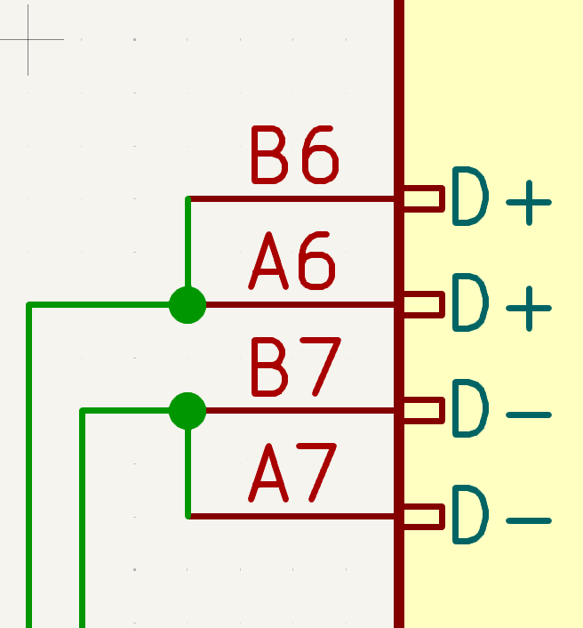 --> corrected
- Replace the current GND symbol with the standard KiCad GND symbol.
->  --> corrected
- Orient the GND symbol downward, following standard schematic conventions.
->  --> corrected
- Replace power global labels with proper KiCad power symbols (use P to place them).
-> 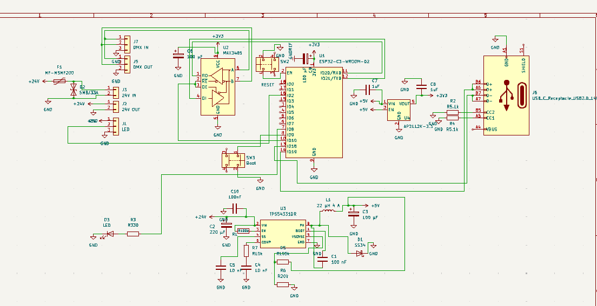 --> corrected
- Missing KiCad project files (.kicad_pro, .kicad_sch, .kicad_pcb).
[kicad_pcb](assets/tube.kicad_pcb)
[kicad_pro](assets/tube.kicad_pro)
[kicad_sch](assets/tube.kicad_sch)

**Total time spent: 1 hours**

## New response after accepted project
"Your first entire spending 3 hours on research will have to be full deflated that is an excessive amount of time. You need to link the firmware, and you need to include the 3d Model you created. You need to add more pictures, and cannot have the inspiration as your cover images. I am also moving this down to Tier 3 as it does not fit T2 guidelines."

Okay for research, the link to firmware: https://kno.wled.ge/ (added to README)

I replace cover image
I place CAD file: [step file](cad/LeTube.step)

**Total time spent: 10 minutes**