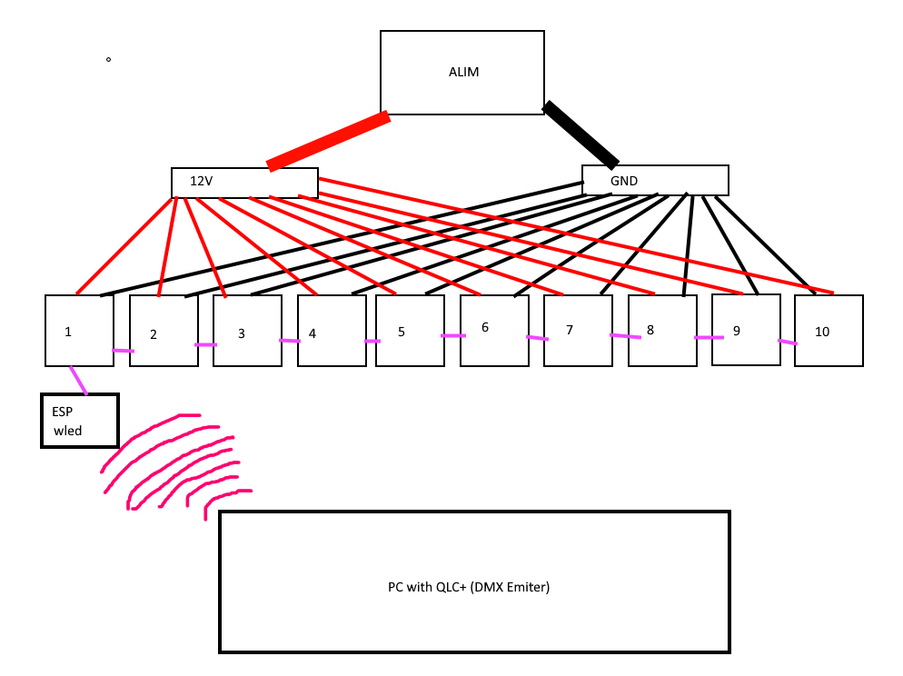
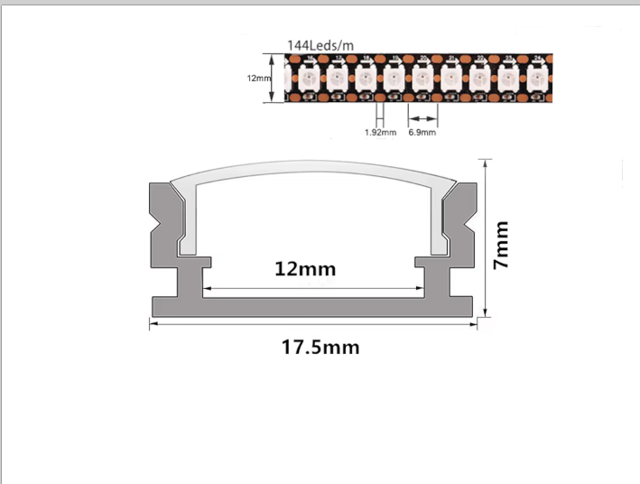

# LeTube

**10 addressable LED tubes for stage lighting, controlled with Art-Net and QLC+.**

LeTube is a DIY project to build a set of 10 LED tubes for stage lighting.

The goal is pretty simple: build something similar to commercial pixel tubes, but for much less money and using hardware that I can actually modify and repair myself.

The tubes use WS2815 12V LED strips and are controlled by a single ESP32 running WLED. QLC+ sends the lighting data through Art-Net over Wi-Fi.

---

# Why am I doing this?

Commercial pixel tubes can get expensive very quickly when you need 10 of them.

I wanted to build my own version instead of buying ready-made tubes.

Another choice I made was to **not put an ESP32 inside every tube**. All the tubes are controlled from one ESP32, which keeps the electronics inside the tubes very simple.

The current version is mainly a prototype / personal project. I'm not trying to make a commercial product with it.

---

# Overview

## Features

* 10 × 1 m LED tubes
* WS2815 12V addressable RGB LEDs
* 144 LEDs/m
* One ESP32 for all 10 tubes
* Art-Net over Wi-Fi
* QLC+ compatible
* WLED based
* Centralized 12V power supply
* Power distribution using busbars
* Aluminium profiles with diffusers
* No controller inside the tubes

---

# Pictures

## 3D / Assembly

## WLED

---

# How it works
QLC+ generates the DMX values and sends them to the ESP32 using Art-Net.

The ESP32 receives the data and WLED handles the LED output.

Each tube contains a 1 meter section of WS2815 strip, so every LED can be controlled individually.

---

# LED Tubes

Each tube is made from an aluminium LED profile with a diffuser.

The current design uses:

* 1 m aluminium profile
* 1 m WS2815 strip
* 12V power
* LED diffuser
* Wiring for power and data

There is no microcontroller inside the tube.

The 10 tubes are connected back to the central controller and power distribution.

---

# Power

The whole LED system is powered from a **12V 600W power supply**.

I use two busbars to distribute the power.

The ESP32 is powered separately.

The reason for using centralized power is mostly simplicity. I don't need a power supply or converter inside every tube.

**The power supply can deliver a lot of current, so the final installation needs properly sized wiring and suitable protection/fusing.**

---

# Control

## WLED

The ESP32 runs WLED.

WLED is used to handle the addressable LEDs and the network communication.

Official documentation:

https://kno.wled.ge/

---

# Hardware

Main components:

* ESP32
* WS2815 12V LED strip
* Aluminium LED profiles
* LED diffusers
* 12V 600W power supply
* M6 power busbars
* Wiring and connectors

The complete BOM is available here:

[BOM.csv](BOM.csv)

---

# Project Files

## KiCad

The KiCad files are available here:

* [PCB](assets/tube.kicad_pcb)
* [Project](assets/tube.kicad_pro)
* [Schematic](assets/tube.kicad_sch)

## CAD

* [STEP model](cad/LeTube.step)

Usage of LeTube.step: this component is used for maintain the tube in horizontal position
---

# BOM

| Category           | Item                                        | Quantity | Unit Price (€) |    Total (€) | Notes                   |
| ------------------ | ------------------------------------------- | -------: | -------------: | -----------: | ----------------------- |
| Power Supply       | 12 V 600 W Switching Power Supply           |        1 |          35.99 |        35.99 | Main power supply       |
| Power Distribution | M6 Battery Bus Bar Power Distribution Block |        2 |           6.50 |        13.00 | 1 positive + 1 negative |
| LED Profile        | Aluminium LED Profile, 0.5 m                |       20 |           2.55 |        51.00 | 10 m total              |
| LED Strip          | WS2815 Addressable RGB LED Strip            |     10 m |          6.656 |        66.56 | 12 V                    |
| Wiring             | Electrical Wire                             |        — |           0.00 |         0.00 | Already available       |
| Controller         | ESP-WROOM-32                                |        1 |           0.00 |         0.00 | Already available       |
| **TOTAL**          |                                             |          |                | **176.55 €** | ≈ **195 USD**           |
